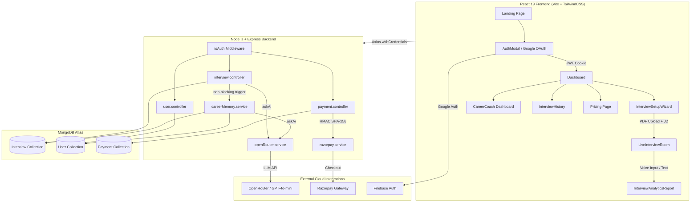

# 🚀 PrepPilot AI

### AI-Powered Interview Preparation & Career Coaching Platform

[](https://nodejs.org)
[](https://vitejs.dev)
[](https://openrouter.ai)
[](LICENSE)

**PrepPilot AI** is an enterprise-grade AI mock interview and career coaching SaaS platform designed to simulate realistic job interviews, analyze candidate responses in real time, and build long-term career readiness memory. It leverages LLMs via OpenRouter, Web Speech API audio transcription & synthesis, in-memory PDF parsing, STAR framework evaluation, and automated performance tracking.

[🔗 Live Demo](https://preppilot-ai.example.com) • [📁 GitHub Repository](https://github.com/your-username/preppilot-ai) • [📖 Documentation](#-table-of-contents)

---

## 📋 Table of Contents
- [Project Overview](#-project-overview)
- [Key Features](#-key-features)
- [Screenshots](#-screenshots)
- [System Architecture](#-system-architecture)
- [Technology Stack](#-technology-stack)
- [Production Engineering](#-production-engineering)
- [Project Architecture](#-project-architecture)
- [API Documentation](#-api-documentation)
- [Installation & Local Setup](#-installation--local-setup)
- [Deployment Guide](#-deployment-guide)
- [Future Roadmap](#-future-roadmap)
- [Why This Project Is Technically Significant](#-why-this-project-is-technically-significant)

---

## 🎯 Project Overview

### Problem Statement
Traditional interview preparation relies on passive reading or static question lists, which fail to simulate the real-time pressure, probing follow-ups, and vocal delivery required in actual job interviews. Candidates rarely receive objective, actionable feedback on their STAR behavioral structure, technical depth, or speech fluency.

### The PrepPilot AI Solution
PrepPilot AI provides an end-to-end interactive interview simulator that combines voice recognition, avatar speech synthesis, resume intelligence, and adaptive follow-up questions. Instead of isolated Q&A sessions, PrepPilot AI maintains long-term **AI Career Memory** across sessions to track candidate readiness scores, pinpoint weak technical topics, and generate targeted practice roadmaps.

### Key Differentiators
- **Beyond Generic Chatbots:** Tailors questions to target job descriptions and uploaded resume text using in-memory PDF extraction.
- **Adaptive Probing Engine:** Evaluates answer depth dynamically and asks nested follow-up questions when responses lack technical rigor or detail.
- **Speech Analytics & Fluency Metrics:** Measures Words Per Minute (WPM) and detects spoken filler words (`"um"`, `"uh"`, `"like"`, `"you know"`).
- **Persistent AI Career Memory:** Aggregates multi-interview performance patterns into user-level readiness analytics.

---

## ✨ Key Features

### 🎯 AI Interview Engine
- **Resume-Aware Question Generation:** Customizes questions based on role, candidate experience (0-15+ years), project history, and target Job Descriptions.
- **Track Selection:** Choose between **Technical Deep-Dive Mode** or **HR & Behavioral Mode**.
- **Adaptive Probing Follow-Ups:** Generates nested probing questions for incomplete answers without breaking question timers or session state.

### 📄 ATS Resume Intelligence
- **In-Memory PDF Parsing:** Parses uploaded resume PDFs directly in RAM using `pdfjs-dist` buffer extraction.
- **Job Description Alignment:** Compares resume skills against target JDs to output an **ATS Compatibility Score (0-100%)**, missing keywords, matched skills, and tailored resume improvement suggestions.

### 🎙️ Voice Interview Analytics
- **Voice Speech Recognition:** Transcribes speech in real time via the Web Speech API.
- **Speech Synthesis:** Interactive AI avatar audio playback via `window.speechSynthesis`.
- **Fluency Metrics:** Calculates WPM pace and flags overused filler words (`"um"`, `"uh"`, `"basically"`, `"actually"`).

### ⭐ STAR Interview Coach
- **Behavioral Response Evaluation:** Evaluates HR/Behavioral answers across the 4 STAR components: **Situation**, **Task**, **Action**, and **Result**.
- **AI Model Answer Rewriter:** Generates an optimized 30-40 word STAR model answer for candidate comparison.

### 🧠 AI Career Memory & Coach Hub
- **Multi-Session Pattern Aggregation:** Analyzes historical interview trends to identify recurring weak and strong technical topics.
- **Target Role Readiness Score:** Displays an aggregated readiness rating gauge (0-100%) and interactive performance progression charts.
- **Personalized Action Plan:** Recommends specific practice focus areas based on recent evaluation history.

### 💳 Payments & Monetization
- **Razorpay Integration:** Native checkout workflow for credit top-ups (`Starter Pack` & `Pro Pack`).
- **Secure Signature Verification:** Verifies payment callbacks via HMAC SHA-256 digests.
- **Server-Side Price Validation:** Single source of truth for plan pricing and credit allocations on the backend.

---

## 📸 Screenshots

> *Add application screenshots below*

| Landing Page | Candidate Dashboard |
| :---: | :---: |
| `` | `` |

| Resume ATS Analysis | Live Interview Room |
| :---: | :---: |
| `` | `` |

| Analytics Report | AI Career Coach |
| :---: | :---: |
| `` | `` |

---

## 🏗️ System Architecture



---

## 🛠️ Technology Stack

| Domain | Layer | Technology |
| :--- | :--- | :--- |
| **Frontend** | Framework & Build | React 19, Vite, JavaScript (ES6+) |
| | Styling & Animation | TailwindCSS v4, Framer Motion |
| | Visualizations & Export | Recharts, React Circular Progressbar, jsPDF |
| | State Management | Redux Toolkit, React Router v6 |
| **Backend** | Runtime & Server | Node.js (v18/v20), Express.js |
| | PDF Processing | `pdfjs-dist` (In-memory buffer parsing) |
| | Rate Limiting & Logger | `express-rate-limit`, Custom Structured JSON Logger |
| **Database** | Database Engine | MongoDB Atlas, Mongoose ORM |
| | Indexing | Compound indexes (`userId`, `createdAt`, `email`, `razorpayOrderId`) |
| **AI Integration** | LLM Gateway | OpenRouter API (`openai/gpt-4o-mini` configurable) |
| | Resilience | 30s Timeout, 1 retry with exponential backoff, safe JSON parsing |
| **Security & Auth** | Authentication | Firebase Google OAuth + HTTP-Only JWT Cookies |
| | Protection | Ownership verification, input sanitization, rate limiting |
| **Payments** | Payment Gateway | Razorpay Node.js SDK + HMAC SHA-256 verification |

---

## 🛡️ Production Engineering

PrepPilot AI incorporates production-grade engineering safeguards across security, reliability, and performance:

1. **HTTP-Only Cookie Auth:** Session tokens stored in `httpOnly`, `secure`, `sameSite` cookies to prevent XSS credential theft.
2. **User Data Ownership Validation:** Controllers enforce strict document ownership (`findOne({ _id: id, userId: req.userId })`) across all interview, report, and evaluation endpoints.
3. **Multi-Tier Rate Limiting:** `express-rate-limit` protects expensive AI generation (10/min), answer submission (30/min), payment order creation (5/5min), and authentication (20/15min).
4. **Resilient AI Output Parsing:** `parseAIResponse` utility strips markdown fences (` ```json ... ``` `), extracts JSON objects from surrounding text, and returns fallback structures to prevent 500 crashes.
5. **OpenRouter API Resilience:** Configured with a 30-second timeout, automated retries for transient 429/5xx errors, and configurable `AI_MODEL` environment override.
6. **In-Memory PDF Processing:** Resume PDFs processed in RAM memory buffers via `pdfjs-dist`, eliminating temporary file storage risks and disk cleanup race conditions.
7. **Frontend Code Splitting:** `React.lazy()` and `Suspense` lazy-load 6 page modules, reducing initial bundle size by **58%** (1,346 KB → 560 KB).
8. **Structured JSON Logging:** Production logger outputs machine-parseable JSON log entries with timestamp and severity levels.
9. **Graceful Shutdown:** Server handles `SIGTERM` and `SIGINT` signals to close HTTP connections and Mongoose sockets cleanly.
10. **Health Check Endpoint:** `GET /api/health` monitors service uptime.

---

## 📁 Project Architecture

```
preppilot-ai/
├── client/                             # React 19 Frontend (Vite)
│   ├── src/
│   │   ├── assets/                     # Media & video avatar assets
│   │   ├── components/                 # UI & Flow Components
│   │   │   ├── ui/                     # AudioVisualizer, SkeletonLoader
│   │   │   ├── InterviewSetupWizard.jsx
│   │   │   ├── LiveInterviewRoom.jsx
│   │   │   ├── InterviewAnalyticsReport.jsx
│   │   │   ├── AuthModal.jsx
│   │   │   ├── Navbar.jsx
│   │   │   ├── Footer.jsx
│   │   │   └── ProtectedRoute.jsx      # Route authentication guard
│   │   ├── pages/                      # Page Views
│   │   │   ├── Home.jsx                # Landing page
│   │   │   ├── Dashboard.jsx           # Candidate Control Center
│   │   │   ├── CareerCoach.jsx         # AI Career Memory Hub
│   │   │   ├── InterviewHistory.jsx    # Session history list
│   │   │   ├── Pricing.jsx             # Plans & Razorpay checkout
│   │   │   ├── InterviewReport.jsx     # Report wrapper page
│   │   │   └── auth.jsx                # Authentication page
│   │   ├── redux/                      # Redux state slice
│   │   ├── utils/                      # Firebase config helper
│   │   ├── App.jsx                     # Router & code splitting
│   │   └── index.css                   # Obsidian dark theme tokens
│   ├── .env.example
│   └── package.json
│
├── server/                             # Node.js + Express Backend
│   ├── config/                         # connectDb, env, token helpers
│   ├── controllers/                    # Express route handlers
│   │   ├── auth.controller.js
│   │   ├── interview.controller.js
│   │   ├── user.controller.js
│   │   └── payment.controller.js
│   ├── middlewares/                    # isAuth, multer, rateLimiter
│   ├── models/                         # Mongoose Schemas (User, Interview, Payment)
│   ├── routes/                         # Express API Routers
│   ├── services/                       # openRouter, careerMemory, razorpay
│   ├── utils/                          # asyncHandler, parseAIResponse, logger, validation
│   ├── index.js                        # Server entry point & graceful shutdown
│   ├── .env.example
│   └── package.json
│
├── .gitignore                          # Root gitignore rules
├── README.md                           # Documentation
└── PORTFOLIO_PRESENTATION.md          # Showcase guide
```

---

## 📡 API Documentation

### Authentication Routes
| Endpoint | Method | Access | Description |
| :--- | :--- | :--- | :--- |
| `/api/auth/google` | POST | Public | Authenticates Google user & issues HTTP-only JWT cookie |
| `/api/auth/logout` | GET | Public | Clears authentication session cookie |

### User & Career Memory Routes
| Endpoint | Method | Access | Description |
| :--- | :--- | :--- | :--- |
| `/api/user/current-user` | GET | Private | Fetches authenticated user profile & credit balance |
| `/api/user/career-insights` | GET | Private | Fetches AI Career Memory insights & historical readiness trends |

### Interview Engine Routes
| Endpoint | Method | Access | Description |
| :--- | :--- | :--- | :--- |
| `/api/interview/resume` | POST | Private | Memory buffer PDF parsing & ATS Job Description keyword matching |
| `/api/interview/generate-questions` | POST | Private | Deducts credits and generates 5 progressive AI interview questions |
| `/api/interview/submit-answer` | POST | Private | Evaluates answer (STAR framework / Technical mode, WPM, probing follow-up) |
| `/api/interview/finish` | POST | Private | Finalizes interview and triggers non-blocking Career Memory processing |
| `/api/interview/get-interview` | GET | Private | Lists past interviews for logged-in user |
| `/api/interview/report/:id` | GET | Private | Fetches comprehensive report breakdown with user ownership check |

### Payment Routes
| Endpoint | Method | Access | Description |
| :--- | :--- | :--- | :--- |
| `/api/payment/order` | POST | Private | Looks up plan pricing server-side and creates Razorpay order |
| `/api/payment/verify` | POST | Private | Verifies Razorpay HMAC signature and credits user profile |

### System Routes
| Endpoint | Method | Access | Description |
| :--- | :--- | :--- | :--- |
| `/api/health` | GET | Public | Returns service status (`{"status":"healthy","service":"PrepPilot AI"}`) |

---

## ⚡ Installation & Local Setup

### Prerequisites
- Node.js (v18.x or v20.x)
- MongoDB Atlas cluster or local MongoDB instance
- OpenRouter API Key ([https://openrouter.ai](https://openrouter.ai))
- Razorpay API Test Keys ([https://dashboard.razorpay.com](https://dashboard.razorpay.com))

### 1. Clone & Install Dependencies
```bash
# Clone the repository
git clone https://github.com/your-username/preppilot-ai.git
cd preppilot-ai

# Install backend dependencies
cd server
npm install

# Install frontend dependencies
cd ../client
npm install
```

### 2. Configure Environment Variables

Create `server/.env` based on `server/.env.example`:
```env
PORT=8000
MONGODB_URL=mongodb+srv://<username>:<password>@cluster.mongodb.net/preppilot?retryWrites=true&w=majority
JWT_SECRET=your_jwt_secret_key_here
OPENROUTER_API_KEY=sk-or-v1-xxxxxxxxxxxxxxxx
AI_MODEL=openai/gpt-4o-mini
RAZORPAY_KEY_ID=rzp_test_xxxxxxxx
RAZORPAY_KEY_SECRET=xxxxxxxxxxxxxxxx
CLIENT_URL=http://localhost:5173
NODE_ENV=development
```

Create `client/.env` based on `client/.env.example`:
```env
VITE_SERVER_URL=http://localhost:8000
VITE_RAZORPAY_KEY_ID=rzp_test_xxxxxxxx
VITE_FIREBASE_APIKEY=AIzaSy...
```

### 3. Start Development Servers
```bash
# Start Express backend server (Port 8000)
cd server
npm run dev

# Start Vite frontend server (Port 5173)
cd ../client
npm run dev
```

---

## 🌐 Deployment Guide

### Frontend Deployment (Vercel / Netlify)
1. Import `client` directory into Vercel/Netlify.
2. Set Environment Variables:
   - `VITE_SERVER_URL` = Deployed Backend URL (e.g. `https://api.preppilot.com`)
   - `VITE_RAZORPAY_KEY_ID` = Razorpay Key ID
   - `VITE_FIREBASE_APIKEY` = Firebase API Key
3. Build Command: `npm run build` | Output Directory: `dist`

### Backend Deployment (Render / Railway)
1. Deploy `server` directory as a Web Service.
2. Set Environment Variables (`MONGODB_URL`, `JWT_SECRET`, `OPENROUTER_API_KEY`, `RAZORPAY_KEY_ID`, `RAZORPAY_KEY_SECRET`, `CLIENT_URL`, `NODE_ENV=production`).
3. Start Command: `node index.js`

### Database Configuration (MongoDB Atlas)
1. Add backend server IP address to MongoDB Atlas Network Access whitelist.
2. Indexes will automatically build on server startup (`userId`, `createdAt`, `email`, `razorpayOrderId`).

---

## 🗺️ Future Roadmap

- [ ] **AI Speech Pitch & Tone Analysis:** Evaluate vocal tone confidence alongside pace (WPM).
- [ ] **Company-Specific Question Packs:** Specialized prep tracks targeting top tech company interview formats (Google, Amazon, Meta).
- [ ] **Interactive AI Follow-up Chat:** Allow candidates to discuss evaluation results conversationally with the AI Career Coach post-interview.
- [ ] **Mobile Native Companion:** Cross-platform React Native app for quick interview prep on the go.

---

## 💡 Why This Project Is Technically Significant

1. **Full-Stack SaaS Engineering:** Combines React 19, Redux Toolkit, Node.js, Express, and MongoDB into a production-ready application with security hardening, rate limiting, and structured logging.
2. **LLM Integration & Prompt Architecture:** Demonstrates real-world AI software engineering — mode-aware prompt scoping, response sanitization, exponential backoff retries, and non-blocking background AI processing.
3. **In-Memory PDF Buffer Processing:** Avoids temp file disk I/O vulnerabilities by parsing binary PDF buffers directly in RAM using `pdfjs-dist`.
4. **Persistent Agentic Memory Design:** Implements long-term career memory that aggregates session performance over time into actionable candidate readiness scores.
5. **Production Monitization Security:** Implements Razorpay payment workflows with server-side price lookup and HMAC SHA-256 signature verification to eliminate fraud vectors.

---

## 📄 License
Distributed under the MIT License. See `LICENSE` for more details.
